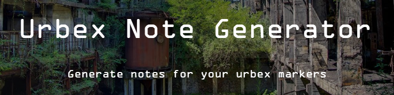

[](https://urbex-note-generator.vercel.app)

A web app and Chrome extension to quickly generate notes for commenting Urbex (urban exploration) locations.

-   [Live Website](https://urbex-note-generator.vercel.app)
-   [Chrome Extension](https://urbex-note-generator.vercel.app/WIP)

---

## Features

-   Generate notes for commenting Urbex locations
-   Copy notes to clipboard
-   Customizable types, status and risks
-   Import/export custom items (via JSON or URL)
-   Color themes (`light`, `dark`, `pink`, `cookie`, `marine`)
-   Chrome extension for quick access
> Side note : data is not shared between the web app and the extension
-   Responsive design for mobile and desktop

---

## Project Structure

```
Urbex-note-generator/
├── site/           # Vue 3 web app (Vite)
│   ├── dist/               # Build output
│   ├── public/             # Static assets
│   ├── src/
│   │   ├── assets/         # CSS, images, JS stores/constants
│   │   ├── components/     # Vue components
│   │   ├── views/          # Vue views/pages
│   │   └── router/         # Vue Router config
│   └── ...
├── extension/      # Chrome extension (iframe wrapper)
│   ├── dist/               # Build output
│   ├── src/
│   │   ├── index.html      # HTML file for the extension
│   │   ├── manifest.json   # Chrome extension manifest
│   │   └── icon.png        # Extension icon
│   ├── build.js            # Build script
│   └── ...
├── README.md               # This file
├── LICENSE                 # License file
└── ...
```

---

## Getting Started

For every following commands, you must be in the [root folder](./) of this repository

### Running the project
#### Web App

1. `npm run install:site` if not already
2. `npm run start:site`

#### Chrome Extension

The process may vary depending on your web browser, the extension was designed to work on **Google Chrome**, under [Manifest V3](https://developer.chrome.com/docs/extensions/develop/migrate/what-is-mv3)

##### From the Chrome Web Store

1. Go to [the extension page](https://urbex-note-generator.vercel.app/WIP)
2. Install the extension

##### From this Repository

1. Go to [chrome://extensions/](chrome://extensions/) in your browser
2. Enable "Developer mode"
3. Click "Load unpacked" and select the [extension/src/](./extension/src/) folder
4. The extension is now installed
> Side note n°1 : You would need to manually refresh the extension from the extension page if you updated it

> Side note n°2 : There is no need of running the `npm run install:extension` command, as it's only used for building before uploading.

### Building for Production

#### Web App
1. run `npm run build:site`, the built files will be in the [site/dist/](./site/dist/) folder

#### Chrome Extension
1. run `npm run install:extension` (if not already)
2. run `npm run build:extension`, the built files will be in the [extension/dist/](./extension/dist/) folder

---

## License

MIT License — see [LICENSE](./LICENSE)
Notice: This project is not affiliated with or endorsed by any Urbex community or organization. It is a personal project for educational purposes.

---

# Privacy Notice

This project does not collect or store any personal data. All data is stored locally in the browser's storage and is not shared with any external servers or services. The Chrome extension operates independently of the web app, and no data is transferred between them.
